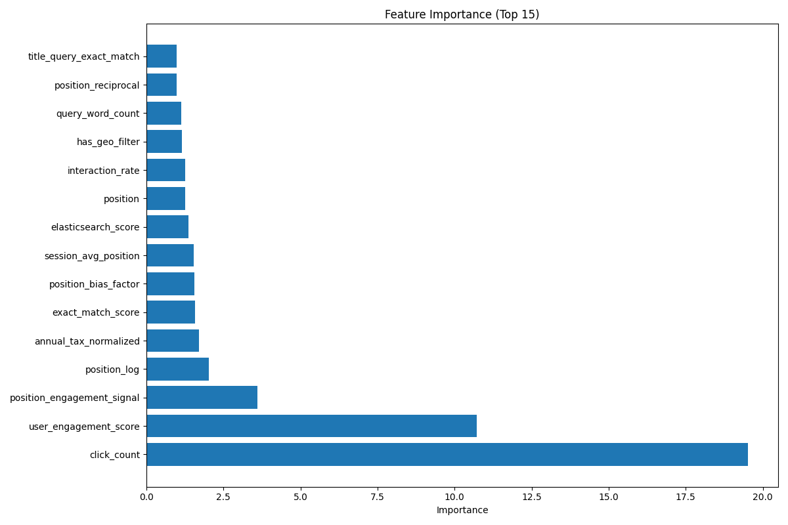

# 🧠 Agentic Search O11y Autotune

A Mastra-based demo that showcases agentic search relevance tuning using observability signals. Built with [Mastra](https://github.com/mastra-ai/mastra), Elasticsearch, and OpenAI.

---

## 📦 Project Structure

This repo uses:

- `mastra` for workflow orchestration
- `@mastra/*` packages for memory, logging, and tool integration
- `@elastic/elasticsearch` for search backend
- `zod` for schema validation
- `pino` for structured logging
- TypeScript + `tsx` for dev ergonomics

---

## 🚀 Getting Started

### ✅ Prerequisites

- **Node.js** `>= 20.9.0`
- **Python** `>=3.10, <3.13`
- **Git**

---

### 📥 Install

```bash
git clone https://github.com/jwilliams-elastic/agentic-search-o11y-autotune.git
cd agentic-search-o11y-autotune
python -m venv .venv
source .venv/bin/activate
pip install -r ./src/python/requirements.txt
npm install
```

---

### ⚙️ Setup

1. Create 1 serverless project
   - Elasticsearch optimized for vectors 
      - you will need to obtain URL for `.env` `ELASTIC_URL` entry
      - you will need to create an API key for `.env` `ELASTIC_API_KEY` entry 

2. Create a `.env` file:

```bash
cp .env.example .env
```

3. Populate `.env` with values for the following variables

```
PROJECT_HOME=YOUR_PROJECT_HOME_ABSOLUTE_PATH
ELASTIC_URL=YOUR_ELASTIC_URL
ELASTIC_API_KEY=YOUR_ELASTIC_API_KEY
GOOGLE_GENERATIVE_AI_API_KEY=YOUR_GOOGLE_GENERATIVE_AI_API_KEY
```

---

### 🛠 Run Mastra 

| Command                                    | Description                              |
|--------------------------------------------|------------------------------------------|
| `npm run dev`                              | Run Mastra in dev mode (hot reload)      |
| `./start.sh`                               | Set python venv then start mastra.       |

---

## 🧪 Demo Flow

1. Open http://localhost:4111/workflows
2. Run 'elastic-setup-workflow' (.env file has default values but you can override in mastra UI)
3. Run 'search-autotune-workflow' (LOW and HIGH option generates different simulated search engagement behavior - HIGH = Luxury, LOW = Affordable)
4. Open http://localhost:4111/agents and run the "Home Search Agent"
5. Show the difference b/t LTR and no-LTR LLM jugdment with a query like "affordable home", "luxury home" and "6 bed, 6 bath single family home near orlando fl with garage and pool under 5M with designer finishes throughout"
6. You can trigger engagement by asking for more detail for a specific result(ex: tell me more about result #20 in v4 results)
7. Open the "Agentic Search Analytics" dashboard - KPIs like CTR, Average Click Position and search template usage.

## 🧪 Development Notes

- Heavy use of vibe coded [TypeScript](https://www.typescriptlang.org/)
- Mastra workflows and tools live in `/src`
- Logs use [pino-pretty](https://github.com/pinojs/pino-pretty) during development
- Logs are shipped to an elasticsearch datastream running in the same serverless project
- LTR script is written in Python with a mastra tool wrapper for invocation

---

## 📁 Folder Structure

```
agentic-search-o11y-autotune/
├── src/                      # Mastra tools, agents, workflows, and utilities (TypeScript)
│   └── mastra/
│       ├── index.ts
│       ├── logger.ts
│       ├── logger-agentless.ts
│       ├── agents/
│       ├── tools/
│       └── workflows/
├── python/                   # Python scripts for LTR, feature analysis, and plotting
│   ├── plot_feature_importance.py
│   ├── properties-learn-to-rank.py
│   └── requirements.txt
├── models/                   # ML models, scalers, and metadata
│   ├── feature_importance.png
│   ├── feature_scaler.pkl
│   ├── home_search_ltr_model.json
│   ├── ltr_model_metadata.json
│   └── xgboost_ltr_model.json
|── dashboards/
│   └── sample_kibana_dashboard.ndjson # prebuilt search o11y dashboard
├── data/                     # Data files and JSONL property data
│   └── properties.jsonl
├── search_templates/         # Mustache templates for ES search
│   ├── properties-search-v1.mustache
│   ├── properties-search-v2.mustache
│   ├── properties-search-v3.mustache
│   └── properties-search-v4.mustache
├── event.schema              # Event schema for analytics
├── feature_importance_analysis.ipynb  # Jupyter notebook for feature analysis
├── sample_kibana_dashboard.ndjson     # Sample kibana dashboard for search analytics
├── mastra.config.js          # Mastra project config
├── package.json              # Project metadata and scripts
├── tsconfig.json             # TypeScript config
└── README.md                 # You're here
```

---

## 📊 Observability Features

This demo includes:

- Search event logging (Mastra logger + pino -> Elasticsearch datastream)
- Search tuning hooks
- Elasticsearch query templates
- Basic analytics-ready output for ES|QL dashboards

## 🙋‍♀️ Questions or Issues?

Create a github issue or email repo maintainers.

---

## 🎯 **Unified Learning-to-Rank (LTR) System**

**NEW: Production-ready LTR system with observability-driven ranking!**

### **🎪 Key LTR Features:**

#### **📡 Observability-Driven:**
- ECS-compliant structured logging
- Real-time feature extraction from user behavior
- Elasticsearch Data Streams: `logs-agentic-search-o11y-autotune.events`

#### **🧬 Feature Engineering (from `properties-learn-to-rank.py`):**
- **Position-aware features:** Result position, log/reciprocal position, position bias, and engagement at position.
- **Search performance:** Elasticsearch score, search time, and template complexity.
- **Query analysis:** Query length, word count, complexity, and presence of geo/price/bedroom filters.
- **User interaction:** Click/view counts, interaction rate, conversational detection, and engagement score.
- **Session context:** Query count, average position, and session duration.
- **Text relevance:** Overlap and exact match between query and property title/description.
- **BM25 relevance:** Field-specific BM25 scores (title, description, features, headings, combined).
- **Semantic similarity:** Embedding-based similarity between query and property description/features.
- **Property attributes:** Normalized price, bedroom/bathroom match, square footage, tax, and maintenance.
- **Geo-relevance:** Estimated distance, geo relevance, and neighborhood match.
- **Query-document matching:** Exact/partial matches and status relevance (e.g., active listings).

These features are extracted and engineered from both search and engagement events, then used to train and evaluate the LTR model for property search ranking.

##### Event Schema
```json
{
  "@timestamp": "2025-08-08T12:34:56Z",
  "event.action": "search_result_logged",         // or "property_engagement"
  "event.type": "search",                        // or "engagement"
  "event.category": ["search"],                  // or ["user"]
  "event.outcome": "success",
  "user.id": "user-123",
  "session.id": "session-abc",                   // flat, for easy filtering/joining
  "query.text": "2 bedroom in Brooklyn",
  "query.template_id": "properties-search-v3",
  "query.filters": {
    "bedrooms": 2,
    "bathrooms": 1,
    "maintenance": 500,
    "square_footage": 800,
    "home_price": 1000000,
    "geo": {
      "latitude": 40.6782,
      "longitude": -73.9442,
      "distance": "10km"
    },
    "features": "balcony"
  },
  "result": {
    "document_id": "property-456",
    "position": 1,
    "elasticsearch_score": 12.34
  },
  "interaction": {
    "type": "property_engagement",               // only for engagement events
    "original_message": "I like this one"
  },
  "performance": {
    "search_time_ms": 123,
    "elasticsearch_time_ms": 100
  },
  "service.name": "elasticsearch-search-tool"
}
```

### **📚 LTR Documentation:**
- **[Complete LTR Guide](./UNIFIED_LTR_GUIDE.md)** - Comprehensive system documentation
- **[ESQL Queries](./ESQL_FEATURE_QUERIES.md)** - Query examples for feature analysis
- **[Confidence Scoring](./CONFIDENCE_SCORE_EXAMPLES.md)** - Pattern-based confidence calculation
- **[Feature Logs](./search-feature-logs.md)** - Feature extraction reference

### **🎉 LTR Business Value:**
- **Real-time Learning**: Continuous improvement from user behavior
- **Zero Breaking Changes**: Seamless integration with existing search
- **Production-Ready**: Enterprise-grade logging and error handling

### Top 15 Features



Here is a concise business logic summary for the top 15 features in the LTR model:

1. **position_log**: Strongly rewards higher-ranked (top) search results, with diminishing returns for lower positions.
2. **position_bias_factor**: Adjusts for user bias toward top results, giving more weight to higher positions.
3. **position_engagement_signal**: Captures user engagement (e.g., clicks) at specific positions, boosting results that get attention even at lower ranks.
4. **click_count**: Directly measures how many times a property was clicked, indicating user interest.
5. **position**: The absolute rank of the result; lower values (top results) are favored.
6. **query_length**: Reflects the complexity or specificity of the user's query; longer queries may indicate more intent.
7. **session_avg_position**: Average position of results viewed in a session, capturing user browsing patterns.
8. **user_engagement_score**: Aggregates various engagement signals (clicks, interactions) into a single score.
9. **view_count**: Counts how many times a property was viewed, showing general interest.
10. **elasticsearch_score**: The original ES relevance score, representing text-based matching.
11. **same_neighborhood**: Indicates if the property is in the same neighborhood as the user's query or filter, boosting local relevance.
12. **time_in_session_ms**: Measures how long the user spent in the session, which can correlate with engagement or satisfaction.
13. **position_reciprocal**: Another way to emphasize top results, giving a higher score to higher-ranked properties.
14. **bm25_title_score**: Measures how well the property title matches the query using BM25 relevance.
15. **search_time_ms**: The time taken to perform the search; can be a proxy for query complexity or backend performance.

These features combine user behavior, search ranking, query complexity, and property relevance to optimize which properties are shown at the top of search results.

